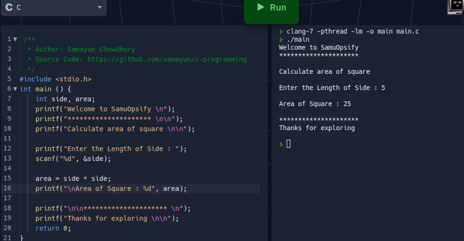
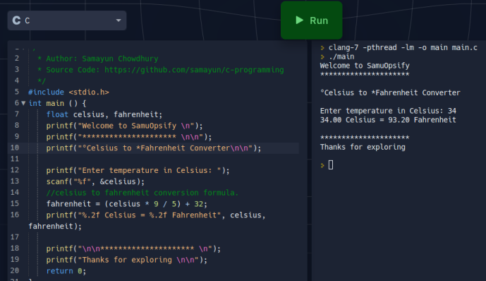
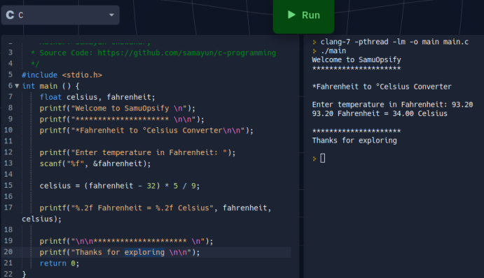

# C Programming 

I'm Samayun Chowdhury.
I'm solving some mathematical problems.

These are available here.
Anyone can practice from here

01. Problem 1: calculate area of square

 

 02. Problem 2: °Celsius to *Fahrenheit Converter

 

 03. Problem 3: *Fahrenheit to °Celsius Converter

 