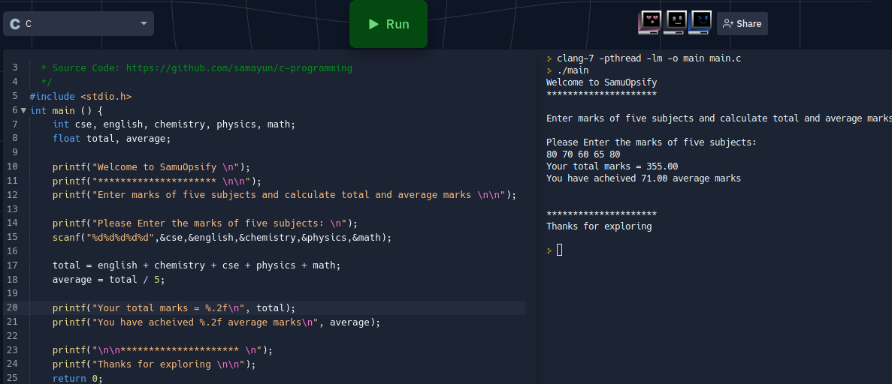

# C Programming 

I'm Samayun Chowdhury.
I'm solving some mathematical problems.

These are available here.
Anyone can practice from here

01. Problem : calculate area of square

 

 02. Problem : °Celsius to *Fahrenheit Converter

 

 03. Problem : *Fahrenheit to °Celsius Converter

 

 04. Problem: Calculate total and average marks of five subjects

 